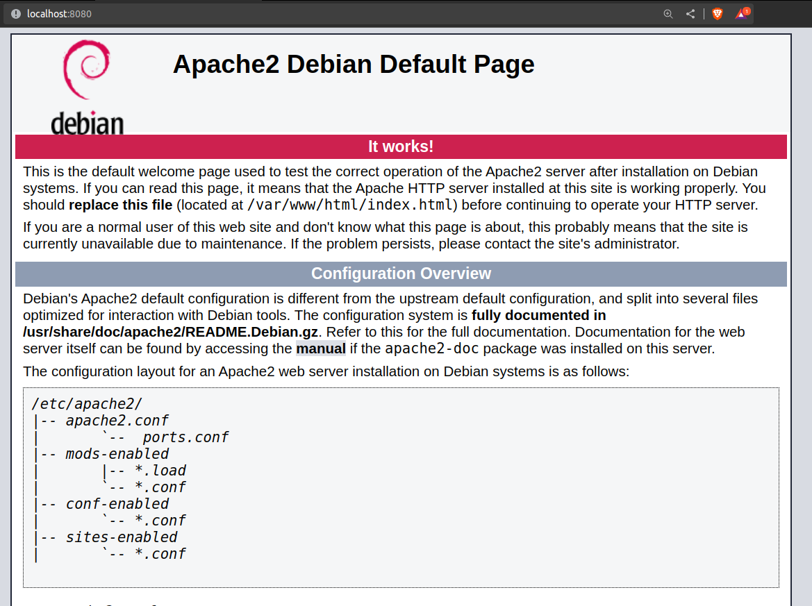
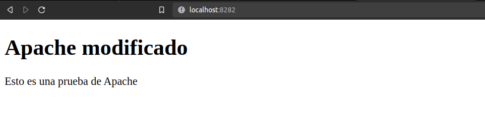
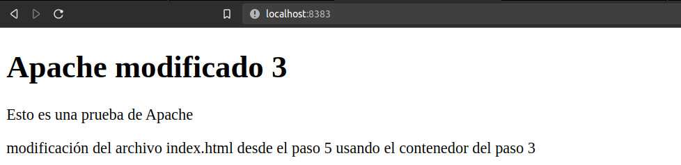
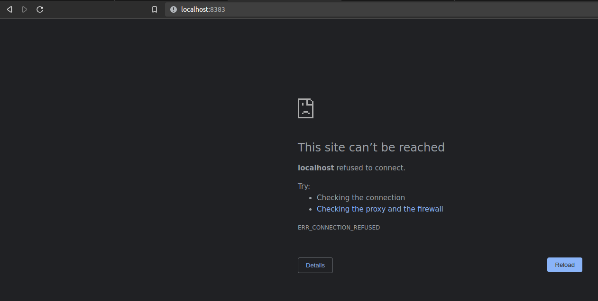

# Parte II:

Ejercicio realizado por Jaime García y Jorge Re González.

## Paso 1:
Crea un contenedor que contenga un servidor Apache. Comprueba si en el navegador se abre la página inicial del contenedor.

```
docker run -it -p 8080:80 eboraas/apache /bin/bash
```

Podemos ver que se ha creado correctamente y que podemos acceder desde el navegador por el puerto 8080.



## Paso 2:
Genera una nueva imagen, a partir de un Dockerfile, que modifique la página inicial. Crea un contenedor a partir de la nueva imagen y abre en el navegador la página inicial del contenedor para comprobar que se ha modificado.

- Creamos el Dockerfile y el index.html en el directorio paso2.

- Lo construimos:

```
docker build -t apache_modificado .
```

- Y creamos el contenedor:

```
docker run -it -p 8282:80 apache_modificado
```



**Nota**: No podemos asignar el mismo puerto (8080) ya que el contenedor anterior sigue funcionando.

## Paso 3:
Crea un nuevo contenedor que la página web inicial esté alojada en una ubicación que aunque se elimine el contenedor ésta no se destruya.

- Reutilizamos el html del paso anterior y creamos el Dockerfile en el directorio paso3.

- Lo construimos:

```
docker build -t apache_modificado_2 .
```

- Y creamos el contenedor:

```
docker run -it -p 8383:80 -v $PWD:/var/www/html/ apache_modificado_2
```


## Paso 4:
Crea un segundo contenedor que abra la misma página web inicial que el contenedor anterior. Comprueba que la pagina web inicial es la misma que la del contenedor del paso 3.

```
docker run -it -p 8484:80 --volumes-from XXXXXX apache_modificado_2
```


**Nota**: Como no le hemos dado nombre al contenedor anterior, tendremos que hacer ```docker ps``` para ver el id o el nombre por defecto que le ha asignado docker para poder identificarlo.

## Paso 5:
Los dos últimos contenedores deben poder comunicarse entre sí, sin utilizar la red por defecto. Realiza la comprobación de que hay comunicación entre ellos.

Como ambos comparten el mismo volumen, se puede acceder a los archivos de uno desde el otro.

Sea XXXXXX el nombre del contenedor del paso 3 y YYYYYY el del paso 4. Podemos modificar el archivo index.html del contenedor XXXXXX y ver que se modifica en el contenedor YYYYYY:

- XXXXXX:
```
docker exec -it XXXXXX /bin/bash
```
```
echo "modificación del archivo index.html desde el paso 5 usando el contenedor del paso 3" >> /var/www/html/index.html
```

Si vemos ahora ambas páginas, vemos que se ha modificado correctamente:




## Paso 6:
Elimina el primer contenedor y constata que la página web inicial no se ha eliminado también.

```
docker stop XXXXXX
docker rm XXXXXX
```


